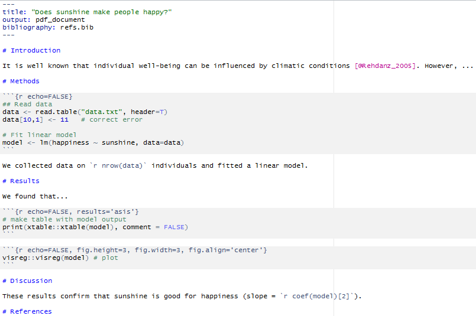
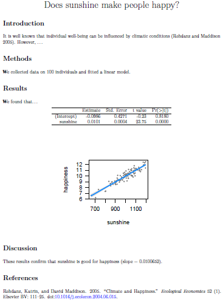
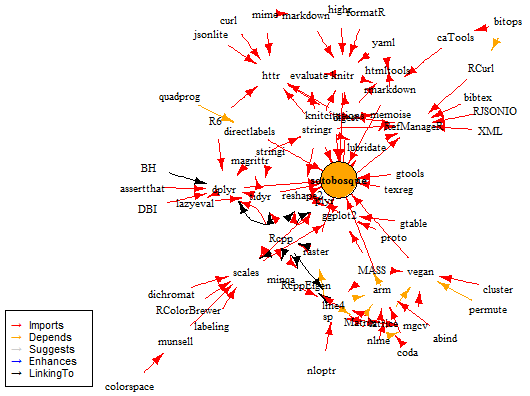

> (1) Departamento de Ecología Integrativa, Estación Biológica de Doñana (EBD-CSIC), Consejo Superior de Investigaciones Científicas, Avda. Américo Vespucio s/n, E-41092 Sevilla, España.

> (2) Laboratorio de Ecología (iEcolab), Instituto Interuniversitario Sistema Tierra (CEAMA), Universidad de Granada, Avda. del Mediterráneo s/n, Granada 18006, España.

> (3) Departamento de Ciencias de la Vida, Facultad de Biología, Ciencias Ambientales y Química, Universidad de Alcalá, Campus Universitario. Ctra. Madrid-Barcelona, Km. 33,600, 28805 Alcalá de Henares, Madrid, España.


> Autor para correspondencia: F. Rodríguez-Sánchez [frodriguez.work@gmail.com]


# Resumen

> **Ciencia reproducible: qué, por qué, cómo**. La inmensa mayoría de los estudios científicos no son reproducibles: resulta muy difícil (si no imposible) entender el proceso de análisis y volver a obtener los mismos resultados, bien porque los datos originales no están disponibles o no se ha publicado un código informático que ejecute el análisis de datos. La trazabilidad y reproducibilidad de los resultados es sin embargo una condición inherente a la ciencia de calidad, y un requisito cada vez más frecuente por parte de revistas y organismos financiadores de la investigación. La ciencia reproducible no sólo acelera el progreso científico (al reducir drásticamente los errores y promover la reutilización de código), sino que también reporta múltiples beneficios para el investigador, incluyendo ahorro de tiempo y esfuerzo, incremento de la calidad e impacto de las publicaciones. En este artículo explicamos en qué consiste la reproducibilidad, por qué es necesaria en ciencia, y cómo podemos hacer ciencia reproducible. Presentamos una serie de recomendaciones y herramientas para el manejo y análisis de datos, control de versiones de archivos, organización de ficheros y manejo de programas informáticos que nos permiten desarrollar flujos de trabajo reproducibles.


# Abstract

> **Reproducible science: what, why, how**. Most scientific papers are not reproducible: it is really hard, if not impossible, to understand how results are derived from data, as well as being able to regenerate those same results in the future, even by the same researchers. This lack of reproducibility is due to original data and/or code used for analysis not being released together with the article. However, traceability and reproducibility of results are indispensable elements of high-quality science, and an increasing requirement of many journals and funding sources. Reproducibility not only accelerates scientific progress (e.g. by reducing errors and facilitating code reuse) but, most importantly, also brings many benefits to the individual researcher. These include time saving, improved collaborations, and higher quality and impact of final publications. In this article we introduce reproducible science, why it is important, and how we can improve our reproducibility. We introduce principles and tools for data management, analysis, version control, and software management that help us achieve reproducible workflows.


# Palabras clave

> reproducibilidad; ciencia abierta; análisis de datos; ecoinformática; ecología; programación


# Keywords

> reproducibility; open science; data analysis; ecoinformatics; ecology; programming


# Introducción 

¿Cuántas veces hemos querido revisitar un análisis meses o años después y no hemos sido capaces, bien porque no recordamos cómo hacerlo o los datos no están fácilmente disponibles? ¿Cuánto tiempo perdemos en rehacer análisis estadísticos, figuras o tablas tras corregir un error en los datos, o siguiendo las recomendaciones de un revisor? ¿Cuánto tiempo invertimos intentando implementar un nuevo método de análisis a partir de la escueta descripción proporcionada en un artículo? ¿Cuántas veces hemos intentado recabar datos infructuosamente porque los autores han perdido los datos, su formato es ilegible hoy día, o simplemente se niegan a compartirlos? 

Todas estas escenas son desgraciadamente frecuentes en el día a día de los científicos, y evidencian un grave problema de reproducibilidad en ciencia [@Peng2011]. La inmensa mayoría de los artículos científicos no son reproducibles, esto es, resulta muy difícil o incluso imposible trazar claramente el proceso de obtención de los resultados y volver a obtenerlos (reproducirlos) ¡Incluso tratándose del mismo equipo de autores! En este artículo discutimos por qué los resultados científicos deben ser reproducibles, presentamos las ventajas de adoptar un flujo de trabajo reproducible, e introducimos las principales herramientas para ello. 


# ¿Qué es la ciencia reproducible?

*"A scientific article is advertising, not scholarship. The actual scholarship is the full software environment, code and data, that produced the result."*
Claerbout & Karrenbach 1992

La ciencia se caracteriza por seguir unas pautas metodológicas que garantizan su validez epistemológica [@Pigliucci2013g]. La confrontación rigurosa de hipótesis con evidencias empíricas (observacionales o experimentales) y el escrutinio público de los resultados contribuyen a garantizar que las conclusiones sean ciertas. Es por ello que los artículos científicos tienen una sección de métodos explicando los pasos seguidos en la recolección y análisis de datos. Esta información resulta crucial para examinar la veracidad y robustez de las conclusiones del artículo, así como para permitir futuras repeticiones del estudio por otros autores. Sin embargo, en la mayoría de ocasiones la escueta descripción verbal que aparece en la sección de métodos resulta insuficiente para conocer todos los detalles del análisis [@Ince2012] (**Fig. 1)**. Este problema resulta cada vez más acuciante con el aumento de la complejidad de los análisis estadísticos [@Michener2012].

Un estudio científico es reproducible si el texto del artículo viene acompañado de código (texto interpretable por un ordenador) que permite recrear exactamente todos los resultados y figuras incluidos en el artículo a partir de los datos originales [@Peng2011; @Marwick2016]. El concepto es por tanto diferente al de repetibilidad, que se refiere a la posibilidad de replicar el mismo estudio (con nuevos datos) a partir de la información proporcionada en el artículo. La reproducibilidad se relaciona principalmente con la transparencia, trazabilidad, y completitud del protocolo seguido para llegar a unos resultados concretos a partir de un conjunto de datos determinado. La reproducibilidad no es una cualidad binaria sino un gradiente que va desde trabajos totalmente irreproducibles (que sólo contienen el texto, tablas y figuras finales) a estudios perfectamente reproducibles donde la integración de texto, código y datos permite regenerar fácilmente el resultado final a partir de los datos originales (e.g. @FitzJohn2014; **Fig. 1**).


# ¿Por qué es necesaria la reproducibilidad en ciencia?

*"Your closest collaborator is you 6 months ago, and you don't respond to emails."*
P. Wilson


La reproducibilidad es un pilar fundamental del método científico: los resultados deben estar basados en datos y evidencias perfectamente contrastables. De hecho, ningún estudio científico puede garantizar que sus resultados sean correctos, pero sí reproducibles [@Peng2011]. La reproducibilidad es por tanto una garantía de transparencia y calidad: los artículos reproducibles están mejor blindados frente a los errores, y cuando los contienen son detectados más fácilmente [@Hayden2015]. Además, la reutilización de código pre-existente por parte de otros autores contribuye a acelerar el progreso científico. En los últimos años ha aumentado la presión por incrementar la reproducibilidad de los trabajos científicos, tras la creciente detección de errores graves en artículos que carecen de garantías de reproducibilidad [@Alberts2015b; @NatureEditorial2014a; @NatureEditorial2014b]. De hecho, el número de revistas y fuentes de financiación que requieren la publicación de datos y código no para de crecer [@Stodden2013]. 

Pero la reproducibilidad no debería ser vista como una obligación impuesta externamente, sino como una oportunidad de mejorar nuestra manera de hacer ciencia y la contribución de nuestros trabajos al avance científico general. En este artículo pretendemos exponer las múltiples ventajas que trae consigo el hacer ciencia reproducible (ver **Tabla 1**), a pesar del esfuerzo inicial que implica siempre el aprender nuevas técnicas de trabajo. 

Para empezar, tener flujos de trabajo reproducibles evita muchos de los problemas planteados al comienzo de este artículo. Por ejemplo, tras corregir un error en los datos o introducir nuevas observaciones podemos volver a generar - sin ningún esfuerzo extra - todas las tablas, figuras y resultados de un trabajo. Esto no sólo ahorra tiempo sino que disminuye drásticamente los errores en el manuscrito final. Igualmente, la existencia de un código que documenta fielmente el proceso de análisis facilita además tanto la escritura del manuscrito como su interpretación por coautores, revisores y los lectores finales [@Markowetz2015a]. Además, dicha transparencia le da un sello de calidad al trabajo y facilita su aceptación, incrementando su impacto posterior en términos de citas y reconocimiento [@Piwowar2007; @Vandewalle2012]. Por ejemplo, la revista *Molecular Ecology* menciona en sus [instrucciones a los autores](http://onlinelibrary.wiley.com/journal/10.1111/%28ISSN%291365-294X/homepage/ForAuthors.html) que "los artículos con archivado de datos y código son más valiosos para investigaciones futuras, por lo que, a igualdad de condiciones, se les dará mayor prioridad para su publicación". La existencia de un código ordenado y bien estructurado permitirá además su reutilización en proyectos posteriores, ahorrando tiempo y esfuerzos al equipo de investigación [@Garijo2013]. Además, compartir públicamente el código con el que generamos unos resultados puede ayudarnos a identificar errores (idealmente antes de su publicación) y abrir nuevas líneas de colaboración [@Hampton2015a]. 


# Cómo hacer ciencia reproducible

*"You can't reproduce if you don't understand where a number came from. | You can't reproduce what you don't remember. And trust me: you won't. | You can't reproduce what you've lost. What if you need access to a file as it existed 1, 10, 100, or 1000 days ago?"*  
(Ben Bond-Lamberty)

Adoptar un flujo de trabajo reproducible requiere un esfuerzo inicial importante. Es necesario familiarizarse con diversas herramientas (bases de datos, programación, sistemas de control de versiones) lo cual lleva su tiempo. Recibir una formación adecuada y temprana (idealmente previa a la realización del proyecto de master o doctorado) facilita mucho las cosas. Dado que el interés por la ciencia reproducible es bastante reciente, en nuestro país la formación es aún escasa o inexistente, aún más en el campo de la ecología. Pero existen cursos, libros y material de aprendizaje fácilmente disponibles (ver **Apéndice 1**). 

La reproducibilidad no es una cualidad binaria sino un gradiente (**Fig. 1**) y conviene implementarla paso a paso en nuestra investigación para facilitar la transición. Un ejemplo extremo de irreproducibilidad sería aquel donde los datos son manipulados en una hoja de cálculo (e.g. Microsoft Excel), posteriormente analizados manualmente en programas estadísticos (como Statistica o SPSS), el manuscrito redactado en un procesador de texto (e.g. Microsoft Word, Google Docs), las figuras realizadas en un programa gráfico (e.g. Sigmaplot, Adobe Illustrator, Photoshop), y los valores de las tablas copiados a mano. Afortunadamente, cada vez es más frecuente que los análisis se hagan mediante código (mayoritariamente R o Python), lo cual representa un avance importante en cuanto a reproducibilidad. Sin embargo, dicho flujo de trabajo incluye todavía múltiples pasos manuales que rompen su dinamismo, no dejan registro de las operaciones realizadas, y abren la puerta a la introducción de errores (por ejemplo, al copiar manualmente múltiples valores a una tabla). En el otro extremo de este gradiente de reproducibilidad estarían los análisis puramente integrados donde el trabajo final puede ser reconstituido a partir de los datos originales con un solo comando o click del ratón (**Fig. 1**).

A continuación presentamos los elementos más importantes de un flujo de trabajo reproducible e introducimos las principales herramientas disponibles para: (i) el manejo de datos; (ii) los análisis de datos mediante código; (iii) el control de versiones; (iv) la organización de los archivos; y (v) el manejo de las dependencias de software externo. En el **Apéndice 1** hemos incluido un listado de recursos que profundizan más en cualquiera de estos aspectos. 

[Aquí debería ir la figura de Antonio sintetizando el workflow. Habría que actualizar la figura para reflejar el texto del ms]


## Recolección y manejo de datos 


El proceso de recolección y manejo de datos resulta crucial ya que cualquier error en esta primera etapa se propagará hasta los resultados finales. Por tanto es muy importante garantizar la calidad de este proceso, que podría dividirse en cinco etapas: (i) planificación; (ii) recolección; (iii) descripción; (iv) control de calidad; y (v) preservación [@Michener2012]. 

### Planificación

Una buena planificación es la mejor forma de asegurar la calidad de los datos. Muchas instituciones (como la National Science Foundation de Estados Unidos) requieren la presentación de un 'data management plan' con cada proyecto. Dicho plan debe incluir información detallada acerca de qué datos se van a obtener y cómo van a recogerse, almacenarse y compartirse [@Michener2015] (por ejemplo véase https://www.dataone.org/sites/all/documents/DMP_Copepod_Formatted.pdf). Existen herramientas como DMPTool (https://dmptool.org/) muy útiles para elaborar esta planificación.


### Recolección

El proceso de obtención de datos ecológicos varía enormemente según el tipo de estudio, desde la captura de organismos en el campo hasta descarga de imágenes de satélite. A pesar de esta heterogeneidad, un principio común a seguir es intentar conservar los datos brutos en su estado original de la mejor manera posible (por ejemplo, insectos capturados en un museo o una colección, fichas de campo en un archivo seguro, imágenes o capas GIS en un repositorio), con un identificador único. Esto nos permitirá revisar estos datos en caso necesario. Complementariamente, la metodología de obtención de datos debe quedar perfectamente registrada. 


### Descripción (metadatos)

Todo conjunto de datos debe ir acompañado de metadatos que provean una descripción detallada de lo que representa cada variable, cómo y dónde se tomó, en qué unidades está medida, etc. Estos metadatos pueden alojarse en un simple fichero de texto plano, pero en ecología existe un 'Ecological Metadata Language' (http://knb.ecoinformatics.org/software/eml/) que sirve de estándar para describir datos de manera interpretable por una computadora, lo cual trae consigo muchas ventajas. Nuevamente existen herramientas para facilitar la creación de estos metadatos (e.g. `Morpho` http://knb.ecoinformatics.org/morphoportal.jsp, o el paquete de R `eml` https://github.com/ropensci/EML/).


### Control de calidad

El control de calidad de los datos es un paso imprescindible pero frecuentemente obviado. Siempre se introducen errores, ya sea en la toma de datos en el campo o al introducirlos en un ordenador y es importante detectarlos y depurarlos. La utilización de plantillas que restrinjan el tipo de datos introducido (e.g. fecha en un formato determinado, valores numéricos dentro de un rango determinado, especie a elegir de un listado predefinido) evita la introducción de muchos errores desde el principio. En cualquier caso, es conveniente realizar un control de calidad final comprobando que todos los datos se ajustan a unos valores adecuados o razonables. Este control de calidad puede hacerse de manera reproducible e iterativa mediante funciones de importación de datos que incluyen tests para comprobar la validez de los datos (e.g. ver http://ropensci.org/blog/2015/06/03/baad). Además, es importante seguir algunas normas básicas de estructuración de los datos [@Wickham2014a] para facilitar su análisis posterior (e.g. ver http://kbroman.org/dataorg/ o http://www.datacarpentry.org/spreadsheet-ecology-lesson/).


### Preservación

Finalmente, debemos buscar la forma de asegurar que nuestros datos seguirán estando disponibles a largo plazo. Un estudio reciente [@Vines2014] estimó que la disponibilidad de los datos se reduce con el tiempo a una alarmante tasa anual del 17%. En muchos casos, la dificultad de acceso a los datos se debe a su almacenamiento en formatos propietarios o dispositivos digitales obsoletos, otras veces simplemente se extravían. La mejor manera de asegurar la persistencia de los datos a largo plazo es alojarlos en formato de texto plano (e.g. txt, csv) en un repositorio oficial de los muchos que hay disponibles ([@White2013]; ver http://www.re3data.org/). Muchos de estos repositorios están orientados a la difusión pública de los datos, pero otros permiten alojamiento privado (e.g. Figshare, KNB, etc). Estos repositorios otorgan un identificador (DOI) a los datos, facilitando su reutilización y citación. Existen múltiples programas (incluyendo paquetes de R) que permiten subir y actualizar nuestros datos fácilmente en estos repositorios online (e.g. ver http://ropensci.org/packages/#data_publication). El alojamiento en la nube representa por tanto la mejor opción para la conservación de los datos [@Hart2015].


## Análisis de datos y documentos dinámicos

Para que un estudio sea reproducible, todo el análisis debe realizarse mediante *scripts* de código, desde la manipulación de los datos hasta la generación de tablas y figuras. Eso significa que debemos evitar hacer ningún cambio directamente sobre los datos originales (e.g. en una hoja de cálculo como Microsoft Excel): los datos originales son intocables, y cualquier modificación posterior debe realizarse mediante código de manera que quede un registro de todos los cambios realizados (idealmente también explicando los motivos, por ejemplo mediante comentarios en el código). 

La utilización de código trae consigo una serie de ventajas frente al análisis manual (*point-and-click*). En primer lugar, el análisis manual es totalmente irreproducible, a diferencia del código que es interpretable tanto para humanos como computadoras. El código contiene un registro perfecto de todos los pasos seguidos en el análisis, muy útil para compartir con colaboradores o reutilizar algún tiempo después. Además, la utilización de código permite automatizar tareas, ahorrando tiempo al investigador. 

En ecología y otras muchas disciplinas científicas el lenguaje de programación dominante desde hace años es R (www.r-project.org). R es un lenguaje gratuito, de código abierto, inicialmente dirigido al análisis de datos y la visualización, pero cuyos usos no paran de crecer gracias a una comunidad muy activa de usuarios-desarrolladores que contribuyen sus propios 'paquetes' con funciones (ver https://cran.r-project.org/web/packages/available_packages_by_name.html). Además de R, existen otros lenguajes de programación bastante extendidos como Python, C, C++, MATLAB, etc. [@Bass2008].

La aparición en el último lustro de herramientas para generar documentos dinámicos a partir de un conjunto de datos y código ([knitr](http://yihui.name/knitr/) y [rmarkdown](http://rmarkdown.rstudio.com) en R, [IPython](http://ipython.org/) para Python, [Jupyter](https://jupyter.org/) para múltiples lenguajes) ha supuesto una revolución en el campo de la ciencia reproducible. Estos programas integran texto y código de manera que es posible regenerar todas las tablas, figuras y resultados presentes en un artículo, libro o informe con un solo click (**Fig. 3**). Ello nos libra por tanto de tener que volver a copiar manualmente todos los valores de una tabla o rehacer figuras con cada iteración del análisis. Por tanto, utilizar documentos dinámicos no solo ahorra tiempo sino que también reduce la probabilidad de cometer errores: todos los resultados son perfectamente trazables a partir de los datos originales. 

En el caso concreto de R, la integración de rmarkdown en Rstudio (www.rstudio.com) facilita la tarea de escribir artículos, tesis, páginas web e incluso presentaciones totalmente reproducibles (www.rmarkdown.rstudio.com). A modo de ejemplo, este artículo está escrito íntegramente en Rmarkdown (véase el código fuente aquí: https://github.com/ecoinfAEET/Reproducibilidad). Aquí (https://github.com/Pakillo/rmdTemplates) puede descargarse una plantilla para escribir artículos en Rmarkdown para la revista Ecosistemas. 


## Control de versiones

El control de versiones es otro de los nudos conflictivos a lo largo del desarrollo de un proyecto. El sistema más común -y problemático- de control de versiones consiste en guardar copias de los archivos (e.g. un documento Word) con distintos nombres, en un intento de reflejar y tener un archivo de todos los cambios aplicados al documento (**Fig. 4**). Este sistema lleva a la acumulación desmesurada de archivos muy similares cuyas modificaciones no son fácilmente comparables, dificultando reconstruir la historia del proyecto, volver atrás en caso de detectar errores, o colaborar con varios coautores que hacen modificaciones sobre el mismo documento. Herramientas como Google Docs, Dropbox, Authorea, u Overleaf representan un gran avance al respecto, pero están más enfocadas a la escritura colaborativa de manuscritos que a la integración dinámica de datos, texto, y código ejecutable como en los documentos de rmarkdown o IPython.

En el campo de la programación existen sistemas de control de versiones muy eficientes (e.g. `git`, `subversion`) que recientemente se han incorporado como herramientas básicas de la ciencia reproducible [@Ram2013a]. `Git` es el sistema más utilizado hoy día, en conjunción con plataformas online como `GitHub` (https://github.com), `BitBucket`, o `GitLab`. Los sistemas de control de versiones se encargan de monitorizar automáticamente los cambios realizados en cualquier fichero, registrando *quién* hizo *qué* cambio, *cuándo* y *por qué* [@Blischak2016]. Git facilita enormemente la tarea de archivar, reconstruir y navegar por la historia de un proyecto. La integración de git en plataformas como GitHub facilita además enormemente el desarrollo conjunto de análisis, código y texto entre todos los colaboradores de un proyecto. A modo de ejemplo, este artículo se escribió utilizando `git` para el control de versiones, y GitHub para colaborar entre los autores. El desarrollo completo del artículo (incluyendo quién hizo qué cambios, cuándo y por qué) está disponible públicamente en GitHub: https://github.com/ecoinfAEET/Reproducibilidad/commits/master.


## Organización de ficheros

Mantener un sistema consistente de organizar todos los archivos relacionados con un proyecto es otro punto importante para garantizar su reproducibilidad (y hacer la vida del investigador más fácil). Cuando no se tiene ningún criterio los archivos se acumulan desordenadamente y resulta muy difícil manejar los distintos componentes del proyecto. Esto no sólo dificulta la comprensión y reutilización en el futuro, sino que también favorece la aparición de errores incontrolados.  

Hay muchas maneras de organizar un proyecto, y cada investigador elige la más conveniente en su caso. Pero sí existen algunos principios básicos a seguir (@Noble2009; véase también https://github.com/Reproducible-Science-Curriculum/rr-init, https://github.com/ropensci/rrrpkg y http://nicercode.github.io/blog/2013-04-05-projects/): (i) todos los ficheros relacionados con el proyecto están dentro del mismo directorio (e.g. un proyecto de Rstudio); (ii) existen subdirectorios independientes que contienen los datos, código, resultados y figuras, y manuscrito; (iii) los datos originales están en un directorio aparte y permanecen inalterados; (iv) los datos derivados van en otra carpeta y se generan mediante scripts; (v) las definiciones de funciones y el script que ejecuta el análisis son ficheros independientes; (vi) en el directorio raíz hay un *script maestro* que ejecuta todos los análisis requeridos para el proyecto; y (vii) en el directorio raíz hay un fichero README que describe el proyecto y sus componentes. 

La **Figura 5a** representa un esqueleto básico de estructura de archivos siguiendo estos principios generales. Convenientemente, dicha estructura es muy similar a la de un paquete de R (**Fig. 5c**). Un paquete de R no es más que una forma estándar de organizar el código (ficheros) que nos permitirá ser más eficientes a la hora de usarlo, compartirlo y re-editarlo [@Varela2015]. Todos los paquetes de R tienen una estructura estándar con una carpeta 'R' donde residen las funciones, una carpeta 'man' que contiene los ficheros de ayuda de esas funciones, un fichero de texto 'NAMESPACE' (generado automáticamente) que especifica las funciones contenidas en el paquete y si dependen de funciones contenidas en otros paquetes, y un fichero 'DESCRIPTION' con los metadatos del paquete: nombre, objetivos, autores, y sus dependencias de otros paquetes. Además pueden añadirse carpetas incluyendo archivos de datos, tests para las funciones, etc. [@Wickham2015b], por lo que la estructura, siendo estándar, mantiene su flexibilidad.

Crear un paquete de R es mucho más fácil de lo que puede parecer (ver **Apéndice 2**), y organizar un proyecto de investigación utilizando esa estructura estándar tiene muchas ventajas (cf. https://github.com/ropensci/rrrpkg), entre ellas: (i) el paquete provee una estructura de directorios para mantener los archivos organizados según los principios esbozados arriba; (ii) las funciones creadas para el análisis quedan documentadas, facilitando su reutilización posterior; (iii) las funciones pueden llevar tests asociados para comprobar que funcionan correctamente, incrementando la robustez del análisis; (iv) se describen explícitamente las dependencias de nuestro análisis en otros paquetes o programas externos, facilitando la reproducibilidad del proyecto. 


## Dependencias externas

Todo análisis reposa sobre plataformas, paquetes o programas que cambian a lo largo del tiempo (**Fig. 6**). Así, nuestros scripts pueden dejar de funcionar al introducirse cambios en alguno de los paquetes de los que depende el proyecto. Igualmente, para poder reproducir un análisis en otro ordenador habrá que instalar primero todas los programas que son necesarios para el proyecto. Por estos motivos conviene documentar las dependencias externas de nuestro análisis (e.g. qué paquetes de R se utilizan, especificando la versión), y asegurarse de que dicho software estará disponible a la hora de intentar reproducir el análisis. 

Hay muchas maneras posibles de registrar las dependencias de nuestro proyecto. Ejecutar la función `sessionInfo` en R (o su equivalente `session_info` del paquete `devtools`) al finalizar el análisis es una de las más sencillas. Este comando devuelve un listado estructurado de todos los paquetes utilizados especificando su versión. Esta información puede ser procesada directamente por paquetes como `switchr` [@Becker2015] para instalar todas las dependencias requeridas en cualquier otro ordenador. Otras opciones incluyen el uso de los paquetes `rctrack` [@Liu2014b], `checkpoint` [@Analytics2015] y `packrat` [@Ushey2015]. Mientras `rctrack` y `packrat` almacenan una copia local de todos los paquetes utilizados en un proyecto, `checkpoint` descarga los paquetes desde un servidor de internet cuando se ejecuta. Estos paquetes son muy fáciles de utilizar y garantizan la reproducibilidad de nuestro proyecto en el futuro aunque cambien los paquetes o dependencias externas. Otras alternativas más avanzadas y versátiles incluyen `docker` [@Boettiger2015] y `drat` [@Eddelbuettel2015]. En el **Apéndice 1** hemos incluido enlaces para iniciarse en el uso de todas ellas.


# Conclusiones

La trazabilidad y reproducibilidad de los resultados científicos es una cualidad inherente a la ciencia de calidad. Hacer ciencia de manera reproducible no sólo es un requisito creciente en muchas revistas y fuentes de financiación sino que además aporta muchas ventajas para el investigador. A la larga, la ciencia reproducible ahorra tiempo y esfuerzo, reduce el riesgo de cometer errores y aumenta el impacto y utilidad de los trabajos en la comunidad científica. 

Desarrollar estudios plenamente reproducibles requiere un esfuerzo inicial de aprendizaje, pero la transición puede hacerse gradualmente. Un buen punto de partida es la utilización de código (scripts) para todo el proceso de manejo y análisis de datos, así como producción de figuras. Este código debe ser capaz de obtener los resultados finales a partir de los datos originales, y ambos pueden publicarse junto con el manuscrito para hacerlo más reproducible. Al mismo tiempo conviene adoptar una estructura estándar para organizar todos los archivos relacionados con un proyecto (datos, código y resultados). Finalmente puede incorporarse un sistema de control de versiones (e.g. git/GitHub) para guardar un registro del desarrollo del proyecto y facilitar la colaboración con otros investigadores. Esperamos que este artículo anime a muchos investigadores a adoptar estas prácticas, y que las pautas y recursos aquí recogidos faciliten la transición hacia una ciencia más reproducible.


# Agradecimientos


FRS está financiado por una ayuda de formación postdoctoral del Ministerio de Economía y Competitividad. 
GitHub, R, Rstudio, knitr, tool builders.
etc


# Referencias

 


###### TABLA 1

**Tabla 1**. Ventajas personales (para el investigador) y generales (para el progreso científico) de la ciencia reproducible

**Table 1**. General and personal benefits of reproducible science.

```{r tabla1}
tabla1 <- read.csv("tablas/tabla_ventajas_reproducibilidad.csv", header = FALSE)
knitr::kable(tabla1)
```


###### TABLA 2

**Tabla 2**. Reproducibility checklist.

**Table 2**. Reproducibility checklist.

```{r tabla2}
tabla2 <- read.csv("tablas/checklist.csv", header = FALSE)
knitr::kable(tabla2)
```


###### PIES DE FIGURA

**Figura 1**. Reproducibility gradient (redrawn from Peng 2011). Pedir permiso a Science.

**Figura 2**. Workflow: revisar. [Antonio?]

**Figura 3**. Ejemplo de documento escrito en Rmarkdown: código fuente en Rmarkdown (izquierda) y resultado (derecha). Si se descubre un error en los datos, las tablas y figuras se actualizan automáticamente. El formato de salida se puede elegir entre html, word, pdf y muchos otros (pandoc).

**Figure 4**. Multiples archivos locos frente a control de versiones con git.

**Figure 5**. (a) Estructura minima de un repo. (b) Estructura mas avanzada (ver https://github.com/Reproducible-Science-Curriculum/rr-init y https://github.com/ropensci/rrrpkg. (c) Estructura de archivos en un paquete de R. 

**Figura 6**. Red de dependencias externas de un proyecto (incluir?).


###### FIGURE LEGENDS

**Figure 1**. 

**Figure 2**.


###### FIGURA 1


###### FIGURA 2

Workflow completo (Antonio)


###### FIGURA 3






###### FIGURA 4


###### FIGURA 5

Estructura de archivos


###### FIGURA 6



Simplificar


###### Mover lista de referencias a la sección de 'Referencias', más arriba en documento final.


